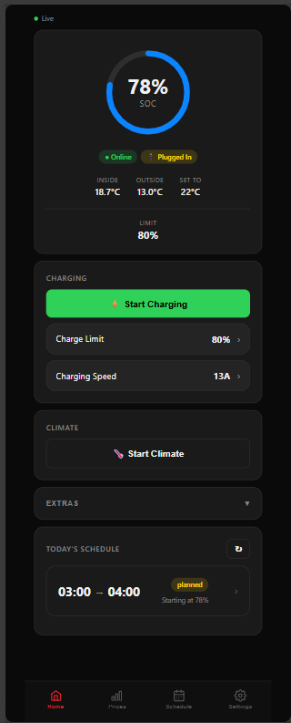

# ⚡ Tesla Mobile Charger

[](LICENSE)
[](docker-compose.yml)
[](https://tinytooltown.com)

A self-hosted, mobile-first Tesla charging scheduler that automatically charges your car during the cheapest electricity hours using Danish Energinet DK1 spot prices.

<p align="center">
  
</p>

---

## Features

| | Feature | Description |
|--|---------|-------------|
| 🔋 | **Live SOC Gauge** | Animated battery ring with real-time state of charge |
| ⚡ | **Smart Schedule** | Cheapest-hour optimizer using Energinet DK1 + Konstant tariffs |
| 📊 | **Price Chart** | 24-hour bar chart for today + tomorrow with lowest price highlighting |
| 🗓 | **Schedule View** | Today's planned charging windows with status badges + expandable price detail |
| 🏠 | **Home Screen Schedule** | Today's next session shown on the dashboard — tap to expand full price detail |
| 🎛 | **Charge Limit** | Tap to open bottom sheet → drag slider → confirm. Respects charger max amps |
| ⚡ | **Charging Speed** | Same tap-to-confirm sheet. Ceiling auto-set from Tesla's reported EVSE max |
| 🌡️ | **Climate Control** | Start/stop pre-conditioning — behind a confirm sheet to prevent accidents |
| 🧲 | **Sentry Mode** | Toggle sentry mode with optimistic UI |
| 🪑 | **Seat Heaters** | Per-seat heat level cycling (Off / Low / Med / High) |
| 🌙 | **Wake Car** | Wake sleeping Tesla with countdown to next data refresh |
| 🔔 | **Push Notifications** | ntfy.sh alerts for charge start/stop/errors |
| ⚙️ | **Settings** | Departure time, target SOC, charger kW, active weekdays, ntfy topic |
| 🔄 | **Optimistic UI** | All controls show a pulsing dot while Tesla confirms — no spinner blocking |
| 📱 | **Mobile App** | Capacitor build for iOS + Android |

---

## Stack

| Layer | Technology |
|-------|-----------|
| Frontend | React, Vite, Chart.js, Capacitor |
| Backend | Node.js, Express, SQLite (better-sqlite3) |
| Real-time | WebSocket (ws) |
| Tesla API | Unofficial Owner API via VCP proxy (EC key auth) |
| Scheduling | node-cron |
| Notifications | ntfy.sh |
| Deployment | Docker + docker-compose |

---

## Architecture

```
Mobile App (React + Capacitor)
  ↕ WebSocket  ↕ REST API
Node.js Backend (Express + SQLite)         port 4002
  ├─ Tesla Owner API → VCP proxy           port 4040
  └─ ntfy.sh push notifications

Frontend (Nginx serving built React app)   port 4001

Cron container (separate Docker service)
  ├─ 13:05 — Fetch Energinet prices for tomorrow
  ├─ 13:10 — Recalculate optimal charging windows
  ├─ Hourly — Start/stop charging per schedule
  └─ Every 5 min — Verify charging if in window
```

---

## Quick Start

### 1. Configure environment

```bash
cp .env.example backend/.env
# Edit backend/.env:
#   TESLA_ENCRYPTION_KEY  — random 32-char string (required)
#   NTFY_TOPIC            — your ntfy.sh topic (recommended)
#   API_SECRET            — random long string for app auth
#   CORS_ORIGIN           — URL where you serve the frontend
```

### 2. Start with Docker

```bash
mkdir -p data
docker-compose up -d
```

| Service | URL |
|---------|-----|
| App (frontend) | http://localhost:4001 |
| API (backend) | http://localhost:4002 |

### 3. Connect your Tesla

Open the app → Settings → enter your Tesla email + password → Save.  
Credentials are AES-encrypted before being stored in SQLite.

---

## Development

### Backend
```bash
cd backend
npm install
cp .env.example .env   # edit as needed
node src/index.js
```

### Frontend
```bash
cd frontend
npm install
npm run dev            # http://localhost:5173
```

---

## Mobile Build (Capacitor)

```bash
cd frontend
npm install
npm run build

# First time only
npx cap add android
npx cap add ios

# Every build after
npx cap sync
npx cap run android    # or: npx cap run ios
```

Distribute the built APK (Android) or IPA (iOS) directly.

---

## Environment Variables

| Variable | Description | Required |
|----------|-------------|----------|
| `TESLA_ENCRYPTION_KEY` | AES key for stored credentials (32+ chars) | ✅ |
| `API_SECRET` | Long random string for backend auth | ✅ |
| `NTFY_TOPIC` | ntfy.sh topic for push notifications | Recommended |
| `NTFY_SERVER` | ntfy server URL (default: `https://ntfy.sh`) | No |
| `PORT` | Backend port (default: `4002`) | No |
| `CORS_ORIGIN` | Allowed frontend origin | No |

---

## UX Design Decisions

- **No accidental commands** — Charge limit, charging speed, and climate controls all require a deliberate tap-to-open sheet + Confirm button before any command is sent to Tesla.
- **Optimistic UI** — Controls respond instantly with a pulsing `●` indicator. The dot clears when Tesla's WebSocket confirms the change (or after 15 s timeout).
- **Charger-aware amps ceiling** — The charging speed slider maximum is set from `chargeCurrentRequestMax` reported by Tesla (the negotiated EVSE limit), not a hardcoded value.

---

## Data & Privacy

- All data stays on your own server — no cloud, no third-party accounts except Tesla and ntfy.sh.
- Tesla credentials are AES-256 encrypted before storage.
- All price history and charging sessions are kept indefinitely for trend analysis.
